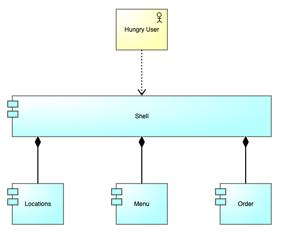

# Demo

Let me start by noting that every minute detail of this live demo is thoroughly
documented. You can find every single command, and every single line of code,
outlined here in my documentation. So, please don't feel like you have to write
down, screenshot, or recall any of this from memory, because you don't!

## Plan

So, today we're going to build a website for a fictitious restaurant called Nx
Grill. We're going to utilize a micro frontend architecture using Module
Federation with Angular and Nx. If you want to follow along, please be aware
that I am using the latest version of Node LTS, 18.15.0, as well as NPM 9.5.0.

| Software    | Version |
| ----------- | ------- |
| Node        | 18.15.0 |
| NPM         | 9.5.0   |

## Architecture



Here is a high level architecture of what we're about to build. You can see
we've got our hungry user here who is probably looking to order a Cheeseburger.
We've got a shell application that is composing everything into a single
cohesisve experience. Then we've got our 3 micro frontends: locations, menu, and
order.

## Generate

```sh
npx create-nx-workspace@latest --name nx-grill --preset empty --nx-cloud false
cd nx-grill
```

We're going to start off by generating our Nx workspace. You'll see here that
this command is called `create-nx-workspace`. This is similar to `ng new` in
Angular or `create-react-app` in React. This will create an empty Nx workspace
with the name nx-grill. I prefer to follow this pattern rather than having Nx
auto-generate our default application. This way we get much more control over
the configuration of our applications.

```sh
npm install --save-dev @nrwl/angular
```

Next, we're going to install the `@nrwl/angular` Nx plugin. There are official
Nx plugins for Angular, NestJS, React, Next, Node, Express, and many more. Plus,
there are many community plugins as well, such as `@nx-dotnet/core` which
provides support for .NET Core apps. This is really cool because it gives you a
single interface, or adapter - the Nx CLI - that can work with every app in your
stack. Also, I should note, today I'm building everything in a monorepo because
it's easier for demo purposes, but that is certainly not a requirement.

```sh
npx nx generate @nrwl/angular:app shell --mfe --mfeType host --style scss --routing true
```

Next up, we're using the `@nrwl/angular` plugin to generate a new Angular
application. We're calling this new application `shell` and telling Nx to
generate a Module Federation configuration as well. You can see here we're
passing the `mfeType` as `host` which tells Nx this is a shell application.

This command is going to take awhile to complete, so let's take some time to
review more info on Nx.

- [https://nx.dev/](https://nx.dev/)

If you haven't used Nx before, I highly recommend it, especially for any new
frontend codebases. You can see here, they call it a "Smart, Extensible Build
Framework." Once you use Nx, it's really hard to work in a codebase without it.
It's one of those things that you don't realize how much you needed until you
have actually used it.

The most powerful feature of Nx is its inherent support for Monorepos. It makes
it super easy to share code between applications using internal libraries,
without having to publish them to an NPM registry.

There's a lot more to Nx than just that though! Things like distributed task
execution, computational caching, powerful code generators, workspace
visualizations, automatic upgrade migrations, and more! If you haven't heard of
it, definitely check out nx.dev to learn more about how it can improve your
developer experience.

Okay, it looks like the command is going extra slow today. What am I saying? Of
course it is, this is a live demo, what do you expect? Well, while we're
waiting, I'll let you know that Nx has some amazing educational resources as
well. There are free Nx courses they provide, as well as amazing documentation
and tutorials to help you learn. For example, here is the Intro to Nx, which is
a great starting point for anyone new.

Hey, looks like it finally finished!

```sh
npx nx generate @nrwl/angular:app locations --mfe --mfeType remote --port 4201 --host shell --style scss --routing true
```

Now we're ready to generate our individual micro frontend applications. We're
starting with the locations micro frontend. You can see here we're telling Nx to
attach this micro frontend as a remote to the shell host. We're also passing in
a custom port number. This is important to enable us to run our micro frontends
simultaneously.

```sh
npx nx generate @nrwl/angular:app menu --mfe --mfeType remote --port 4202 --host shell --style scss --routing true
```

Now we're generating the menu micro frontend with all of the same settings,
other than the port number.

```sh
npx nx generate @nrwl/angular:app order --mfe --mfeType remote --port 4203 --host shell --style scss --routing true
```

Last application now, this will generate our order micro frontend.

```sh
npx nx generate @nrwl/angular:component --project menu remote-entry/breakfast
npx nx generate @nrwl/angular:component --project menu remote-entry/lunch
npx nx generate @nrwl/angular:component --project menu remote-entry/dinner
```

We will now generate a few components for our menu micro frontend. This will
give us the opportunity to see a slightly more advanced micro frontend in
action. It will include breakfast, lunch, and a dinner components. You'll notice
we're creating these within the remote-entry folder. You'll want to do that as
well. Anything you add should be within that folder. You'll never touch your app
module or app component, they are only useful for local development when using
the standalone mode which I'll demo for you shortly.

## Code

Next, we have a few code changes to make. I'm going to copy/paste most of this
code to save time.

### Update MFE app.component.html

- apps/locations/src/app/app.component.html
- apps/menu/src/app/app.component.html
- apps/order/src/app/app.component.html

```html
<router-outlet></router-outlet>
```

### Update Shell app.component.html

```html
<main>
  <h2>Links</h2>
  <ul>
    <li><a routerLink="">Home</a></li>
    <li><a routerLink="locations">Locations</a></li>
    <li><a routerLink="menu">Menu</a></li>
    <li><a routerLink="order">Order</a></li>
  </ul>
</main>
```

### Update MFE app.module.ts

- apps/locations/src/app/app.module.ts
- apps/menu/src/app/app.module.ts
- apps/order/src/app/app.module.ts

```ts
RouterModule.forRoot([
  {
    path: '',
    loadChildren: () => import('./remote-entry/entry.module').then((m) => m.RemoteEntryModule),
  },
], { initialNavigation: 'enabledBlocking' }),
```

### Update MFE entry.module.ts

- apps/locations/src/app/remote-entry/entry.module.ts
- apps/menu/src/app/remote-entry/entry.module.ts
- apps/order/src/app/remote-entry/entry.module.ts

Replace `BrowserModule` with `CommonModule`.

### Update Locations entry.component.ts

```html
<h2>Locations</h2>
<p>Our locations system is currently undergoing scheduled maintenance.</p>
```

### Update Menu entry.component.ts

```html
<h2>Menu</h2>
<ul>
  <li><a routerLink="breakfast">Breakfast</a></li>
  <li><a routerLink="lunch">Lunch</a></li>
  <li><a routerLink="dinner">Dinner</a></li>
</ul>
<router-outlet></router-outlet>
```

### Update Order entry.component.ts

```html
<h2>Order</h2>
<p>Our online order system is currently undergoing scheduled maintenance.</p>
```

### Update Menu entry.module.ts

```ts
children: [
  {
    path: 'breakfast',
    component: BreakfastComponent,
  },
  {
    path: 'lunch',
    component: LunchComponent,
  },
  {
    path: 'dinner',
    component: DinnerComponent,
  },
],
```

## Run

```sh
npx nx run shell:serve-mfe
```

This is going to spin up all 4 applications, so it may take awhile. Let's use
that time to review some of the Module Federation code that was auto-generated
by Nx.

### Open apps/shell/webpack.config.js

This is the Webpack config that Nx generated for us. This is where Module
Federation is configured. You can see here it's setup to load 3 remotes:
locations, menu, and order. Obviously, these correspond to our 3 micro
frontends. There's also this shared section. This is where you configure any
shared libraries used by all of your applications. This will ensure they are
only loaded once and dramatically decrease your bundle sizes.

### Open apps/order/webpack.config.js

You can see here that the remote Webpack config is very similar. Instead of
specifying remotes, it instead exposes our remote entry module. This is what
enables the shell to import it using a dynamic import.

## Visual

It looks like our command has finally finished, so let's take a look at our new
website for Nx Grill.

- [http://localhost:4200/](http://localhost:4200/)

Alright, here is our shell. As you can see, it is simply a list of links to each
of the micro frontends. If I click Locations, you can see the locations micro
frontend loads. If I click Menu, the menu micro frontend loads. From there, I
can view the breakfast, lunch, and dinner pages as well. Notice in the URL bar
here, everything after menu is owned by this micro frontend. It has complete
control from this point and can have as many routes and nested children as it
wants. And, of course, if I click Order, that micro frontend appears as well.

Now, let's go back to the home page because I want to show you a few more
things. You'll see here that we are loading 3 `remoteEntry.js` files, one for
each micro frontend. Now, you might be thinking, Jason, shouldn't we be lazy
loading these? Well, not exactly. Loading these upfront is important in order to
facilitate the shared dependency negotation. Without this, we wouldn't be able
to share dependencies and bundle sizes would grow out of control.

This could be a concern if you want to have a micro frontend architecture that
is composed of hundreds of smaller fragments. If that is the case, I'd encourage
you to consider the web component approach which is much more condusive to that
type of use-case.

Fortunately, this file will remain pretty small because the rest of the code for
each micro frontend is lazily loaded. When I visit each micro frontend, it loads
its corresponding `common.js` file. These files are small as well.

Lastly, I'd like to show that you can run each micro frontend in standalone mode
as well.

- [http://localhost:4201/](http://localhost:4201/)
- [http://localhost:4202/](http://localhost:4202/)
- [http://localhost:4203/](http://localhost:4203/)

This can be helpful if you want to iterate quickly without having to load the
entire shell. However, I highly recommend just working from within the shell to
ensure a solid end-to-end integration.

While this has been a super simple example, you can use a micro frontend
architecture for even the most complex of applications. We started our micro
frontend journey back in 2019 using a microsite or micro-app approach. We then
transitioned to the custom element or web component approach. This year, we
migrated to using Module Federation and we're very happy with it and plan to
stick with it for the foreseeable future.

How about I show you our portal as a real world example? 

Okay, that's all for the live demo, so let's switch back to the slides to wrap
up with some closing thoughts.
